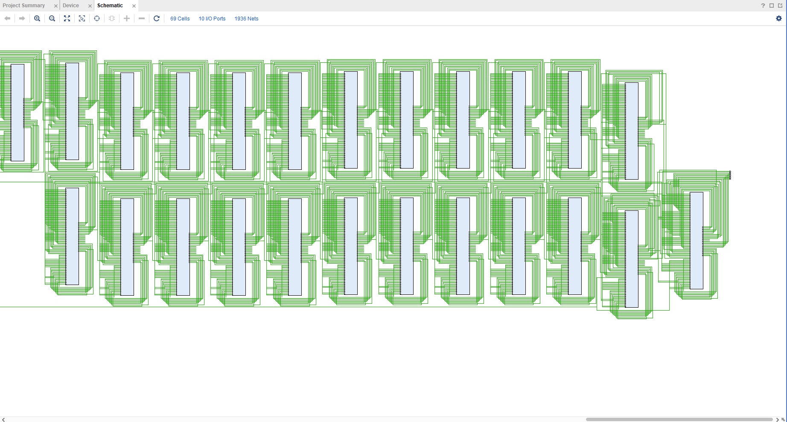
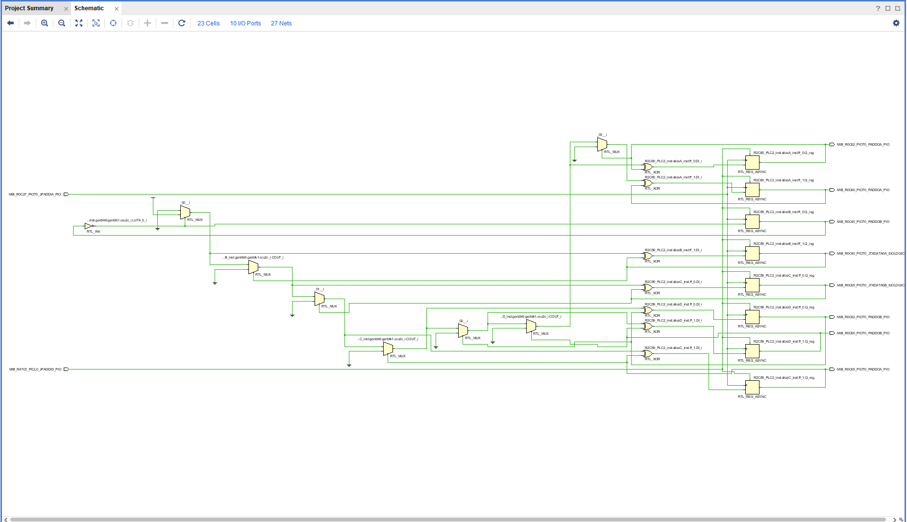

# Lattice ECP5 Bitstream Decompiler

## Introduction

As part of the Pwn2Win 2021 challenge `Ethernet From Above`, I spent a lot of time writing a Lattice ECP5 bitstream to verilog decompiler. AFAIK, my code gives a perfect decompilation for bitstreams that use the PLC2 logic cells, MIB block ram tiles, and standard IO pins. I have not tested PLL IO pins/tiles very closely, and there may be functionality missing there. It is difficult to debug that since there doesn't exist documentation of the PLL tiles, and the fabric routing is, of course, proprietary. All the ECP5 details are from the [nextpnr](https://github.com/YosysHQ/nextpnr), [Project Trellis](http://yosyshq.net/prjtrellis-db/), and [yosys](https://github.com/YosysHQ/yosys).

## Usage

Convert bitstream file to textconfig file with ecpunpack.

```
ecpunpack FILENAME.bit FILENAME.tcf
```

Then decompile textconfig to verilog.

```python
ecp5 = ECP5("FILENAME.tcf")
ecp5.write_code("FILENAME.v")
```

The decompiled verilog file is based on the standard cells [PLC2 tile](cells/tile.v) with [Trellis Slices](cells/cells_sim.v) and [PDPW16KD](cells/PDPW16KD_wrapper.v) block ram in ECP5. Disclaimer: my implementation of PDPW16KD is incomplete; it's a proprietary standard cell.

## Example

Let's take an 8-bit counter example.

```verilog
module top(input clk, input btn, output [7:0] led);
    reg[7:0] count;
    reg[7:0] next_count;

    always @ (posedge clk or posedge btn) begin
        if (btn) begin
            count <= '0;
        end else begin
            count <= next_count;
        end
    end

    always @ (count) begin
        next_count = count + 1;
    end

    assign led = count;
endmodule
```

File is in `example/counter.v` and bitfile compiled with Project Trellist and nextpnr is in `example/counter.bit`. Run `python Decompiler.py` to decompile bitfile into `example/counter_decomp.v`

The netlist is pretty much unreadable. Most of the PLC2 tiles used are present in the netlist and the routing between them as well. It will look something like this if visualized with Vivado:



However, we can use yosys and vivado to lift the standard cells into simplified RTL representation with the following yosys script:

```
read_verilog counter_decomp.v
synth
flatten
opt
clean
opt_clean
write_verilog synth.v
```

It looks like this visualized with Vivado:



The logic is perfect. I've written a testbench, connected the ports, and simulated the counter - it works perfectly.

Additionally, I've verified that it works at scale as well. It is 99% accurate, if not perfect at scale.